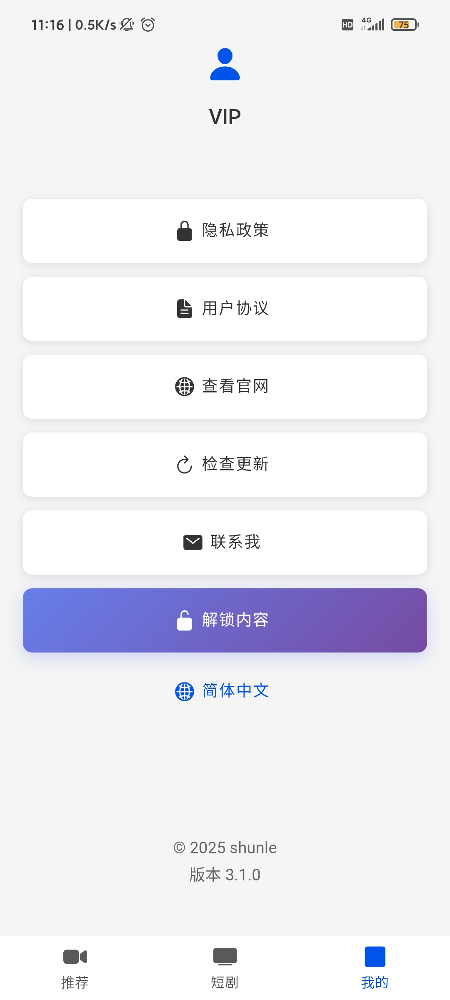
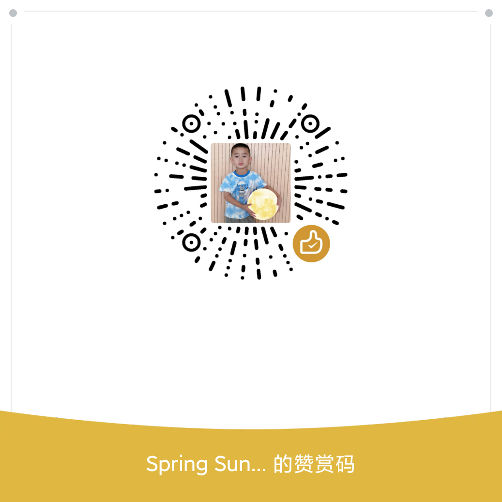

简体中文 / [English](./README_EN.md)
# qyl 项目

一个基于 Vue 3、Ionic Framework 和 Capacitor 构建的现代移动应用。

## 项目简介

本项目是一个功能丰富的移动应用，支持视频播放、文件管理、多语言切换等功能。应用使用现代化的前端技术栈构建，支持 Android 平台，具有良好的用户体验和性能表现。

<p align="center">
  
  
  
  
  
  
</p>

### 主要功能

- 📱 响应式移动端界面设计
- 🎥 视频播放和管理
- 📁 文件操作和管理
- 🌍 多语言国际化支持
- 📊 数据分析和统计
- 🔄 数据同步和缓存
- 📱 原生设备功能集成

## 技术栈

### 核心框架
- **Vue 3** - 渐进式 JavaScript 框架
- **Ionic Framework 8** - 跨平台移动应用框架
- **Capacitor 7** - 原生桥接层

### 开发工具
- **TypeScript** - 类型安全的 JavaScript
- **Vite** - 快速构建工具
- **Vue Router 4** - 客户端路由
- **Vue I18n** - 国际化解决方案

### 移动端功能
- **Video.js** - 视频播放器
- **Swiper** - 轮播组件
- **Axios** - HTTP 客户端
- **Crypto-js** - 加密工具

### 开发和测试
- **ESLint** - 代码规范检查
- **Vitest** - 单元测试框架
- **Cypress** - 端到端测试

## 快速开始

### 环境要求

- Node.js 16.x 或更高版本
- npm 或 yarn
- Android Studio（用于 Android 开发）
- JDK 17（Capacitor 7.x 推荐）

### 安装和运行

1. **克隆项目**
   ```bash
   git clone https://github.com/liumaowen/qyl.git
   cd qyl
   ```

2. **安装依赖**
   ```bash
   npm install
   ```

3. **本地开发**
   ```bash
   npm run dev
   ```
   访问 `http://localhost:5173` 查看应用

4. **构建应用**
   ```bash
   # 生产构建
   npm run build

   # 调试构建
   npm run build:debug
   ```

5. **移动端开发**
   ```bash
   # 同步 Capacitor 平台
   npx cap sync

   # 打开 Android 项目
   npx cap open android
   ```

## 可用脚本

| 命令 | 描述 |
|------|------|
| `npm run dev` | 启动开发服务器 |
| `npm run build` | 构建生产版本 |
| `npm run build:debug` | 构建调试版本 |
| `npm run preview` | 预览构建结果 |
| `npm run test:unit` | 运行单元测试 |
| `npm run test:e2e` | 运行端到端测试 |
| `npm run lint` | 代码规范检查 |

## 项目结构

```
qyl/
├── src/
│   ├── api/              # API 服务
│   ├── components/       # 可复用组件
│   ├── composables/      # Vue 组合式函数
│   ├── config/           # 配置文件
│   ├── locales/          # 国际化文件
│   ├── router/           # 路由配置
│   ├── store/            # 状态管理
│   ├── utils/            # 工具函数
│   ├── views/            # 页面组件
│   └── App.vue           # 根组件
├── public/               # 静态资源
├── android/              # Android 平台代码
├── tests/                # 测试文件
└── capacitor.config.ts   # Capacitor 配置
```

### 主要页面

- **Tab1Page** - 主页/视频内容
- **Tab2Page** - 辅助功能页面
- **Tab3Page** - 扩展功能页面
- **ShortDramas** - 短视频内容
- **My** - 个人中心
- **DramasDetail** - 内容详情页
- **AnalyticsDemo** - 分析演示页

## 部署

### 云端打包

1. **GitHub Actions**
   - 项目支持 GitHub Actions 自动打包 APK
   - 推送代码后自动触发构建流程

2. **Ionic Appflow**
   - 支持上传到 Appflow 进行云端打包
   - 提供更丰富的构建选项和分发功能

### 本地打包

```bash
# 构建 Web 版本
npm run build

# 同步到 Android
npx cap sync android

# 在 Android Studio 中打包 APK
npx cap open android
```

## 开发指南

### 代码规范

- 使用 TypeScript 进行类型检查
- 遵循 ESLint 代码规范
- 组件命名使用 PascalCase
- 文件命名使用 kebab-case

### 国际化

项目支持多语言，语言文件位于 `src/locales/` 目录：

```typescript
// 使用示例
import { useI18n } from 'vue-i18n'

const { t } = useI18n()
const message = t('common.hello')
```

### 状态管理

使用 Vue 3 的响应式 API 进行状态管理：

```typescript
// src/store/state.ts
import { reactive } from 'vue'

export const globalState = reactive({
  // 全局状态
})
```

## 常见问题

### 环境配置

- **JDK 版本**: Capacitor 7.x 推荐使用 JDK 17
- **Android SDK**: 确保安装最新版本的 Android SDK
- **Node.js**: 推荐使用 Node.js 18.x 或更高版本

### 插件兼容性

- 插件版本与 Capacitor 版本保持兼容
- 参考各插件官方文档进行配置
- 注意 Android API 级别要求

### 性能优化

- 使用 Vite 的代码分割功能
- 合理使用 Vue 3 的 `defineAsyncComponent`
- 优化图片和视频资源大小

## 贡献指南

1. Fork 本仓库
2. 创建特性分支 (`git checkout -b feature/AmazingFeature`)
3. 提交更改 (`git commit -m 'Add some AmazingFeature'`)
4. 推送到分支 (`git push origin feature/AmazingFeature`)
5. 开启 Pull Request

## 版本历史

- **v3.1.0** - 当前版本
  - 升级到 Capacitor 7.x
  - 新增多语言支持
  - 优化视频播放功能

## 许可证

本项目采用 [MIT 许可证](LICENSE)。

## 贡献

[Buy Me a Coffee](https://ko-fi.com/springsunshine)


## 联系方式

如有问题或建议，请通过以下方式联系：

- 提交 Issue
- 发起 Pull Request
- 邮件联系项目维护者