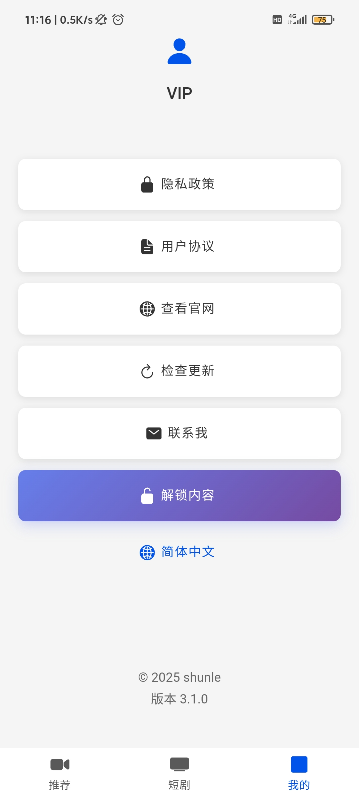

# QYL Project

A modern mobile application built with Vue 3, Ionic Framework, and Capacitor.

## Project Overview

This project is a feature-rich mobile application that supports video playback, file management, multi-language switching, and more. Built with modern frontend technologies, it supports Android platform with excellent user experience and performance.

<p align="center">
  
  
  
  
  
  
</p>

### Key Features

- 📱 Responsive mobile interface design
- 🎥 Video playback and management
- 📁 File operations and management
- 🌍 Multi-language internationalization support
- 📊 Data analytics and statistics
- 🔄 Data synchronization and caching
- 📱 Native device feature integration

## Technology Stack

### Core Frameworks
- **Vue 3** - Progressive JavaScript framework
- **Ionic Framework 8** - Cross-platform mobile app framework
- **Capacitor 7** - Native bridge layer

### Development Tools
- **TypeScript** - Type-safe JavaScript
- **Vite** - Fast build tool
- **Vue Router 4** - Client-side routing
- **Vue I18n** - Internationalization solution

### Mobile Features
- **Video.js** - Video player
- **Swiper** - Carousel component
- **Axios** - HTTP client
- **Crypto-js** - Encryption utilities

### Development and Testing
- **ESLint** - Code linting
- **Vitest** - Unit testing framework
- **Cypress** - End-to-end testing

## Getting Started

### Prerequisites

- Node.js 16.x or higher
- npm or yarn
- Android Studio (for Android development)
- JDK 17 (recommended for Capacitor 7.x)

### Installation and Setup

1. **Clone the project**
   ```bash
   git clone https://github.com/liumaowen/qyl.git
   cd qyl
   ```

2. **Install dependencies**
   ```bash
   npm install
   ```

3. **Local development**
   ```bash
   npm run dev
   ```
   Visit `http://localhost:5173` to view the app

4. **Build the application**
   ```bash
   # Production build
   npm run build

   # Debug build
   npm run build:debug
   ```

5. **Mobile development**
   ```bash
   # Sync Capacitor platforms
   npx cap sync

   # Open Android project
   npx cap open android
   ```

## Available Scripts

| Command | Description |
|---------|-------------|
| `npm run dev` | Start development server |
| `npm run build` | Build for production |
| `npm run build:debug` | Build with debug options |
| `npm run preview` | Preview production build |
| `npm run test:unit` | Run unit tests |
| `npm run test:e2e` | Run end-to-end tests |
| `npm run lint` | Run code linting |

## Project Structure

```
qyl/
├── src/
│   ├── api/              # API services
│   ├── components/       # Reusable components
│   ├── composables/      # Vue composables
│   ├── config/           # Configuration files
│   ├── locales/          # Internationalization files
│   ├── router/           # Router configuration
│   ├── store/            # State management
│   ├── utils/            # Utility functions
│   ├── views/            # Page components
│   └── App.vue           # Root component
├── public/               # Static assets
├── android/              # Android platform code
├── tests/                # Test files
└── capacitor.config.ts   # Capacitor configuration
```

### Main Pages

- **Tab1Page** - Home/Video content
- **Tab2Page** - Secondary features
- **Tab3Page** - Extended features
- **ShortDramas** - Short video content
- **My** - User profile/account
- **DramasDetail** - Content detail view
- **AnalyticsDemo** - Analytics demo

## Deployment

### Cloud Building

1. **GitHub Actions**
   - Supports automatic APK building via GitHub Actions
   - Automatically triggered after code push

2. **Ionic Appflow**
   - Upload to Appflow for cloud building
   - Provides richer build options and distribution features

### Local Building

```bash
# Build web version
npm run build

# Sync to Android
npx cap sync android

# Package APK in Android Studio
npx cap open android
```

## Development Guide

### Code Standards

- Use TypeScript for type checking
- Follow ESLint code standards
- Component naming uses PascalCase
- File naming uses kebab-case

### Internationalization

The project supports multiple languages with language files located in `src/locales/`:

```typescript
// Usage example
import { useI18n } from 'vue-i18n'

const { t } = useI18n()
const message = t('common.hello')
```

### State Management

Uses Vue 3's reactivity API for state management:

```typescript
// src/store/state.ts
import { reactive } from 'vue'

export const globalState = reactive({
  // Global state
})
```

## Common Issues

### Environment Configuration

- **JDK Version**: Capacitor 7.x recommends JDK 17
- **Android SDK**: Ensure latest Android SDK is installed
- **Node.js**: Recommend Node.js 18.x or higher

### Plugin Compatibility

- Keep plugin versions compatible with Capacitor version
- Refer to official documentation for each plugin
- Pay attention to Android API level requirements

### Performance Optimization

- Use Vite's code splitting features
- Properly use Vue 3's `defineAsyncComponent`
- Optimize image and video resource sizes

## Contributing

1. Fork this repository
2. Create a feature branch (`git checkout -b feature/AmazingFeature`)
3. Commit your changes (`git commit -m 'Add some AmazingFeature'`)
4. Push to the branch (`git push origin feature/AmazingFeature`)
5. Open a Pull Request

## Version History

- **v3.1.0** - Current version
  - Upgraded to Capacitor 7.x
  - Added multi-language support
  - Optimized video playback features

## License

This project is licensed under the [MIT License](LICENSE).

## 贡献

[Buy Me a Coffee](https://ko-fi.com/springsunshine)

## Contact

For questions or suggestions, please contact us through:

- Submit an Issue
- Open a Pull Request
- Email the project maintainers